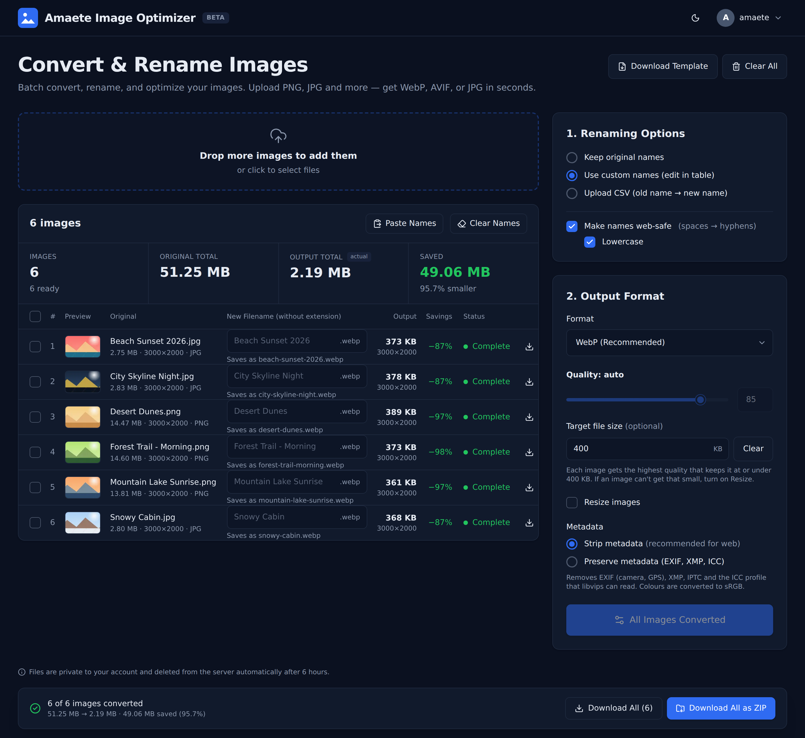
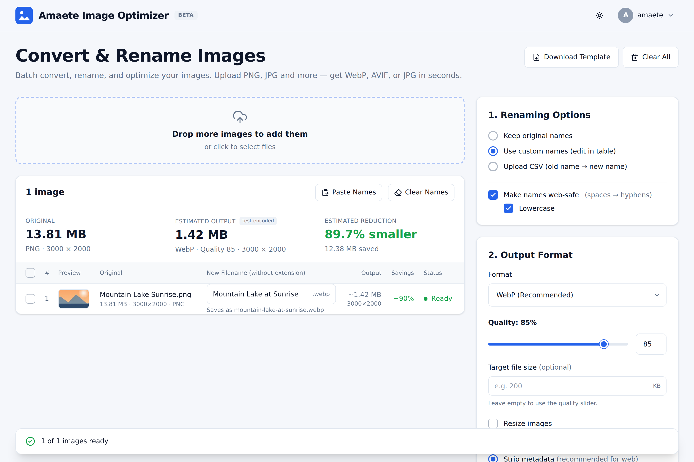
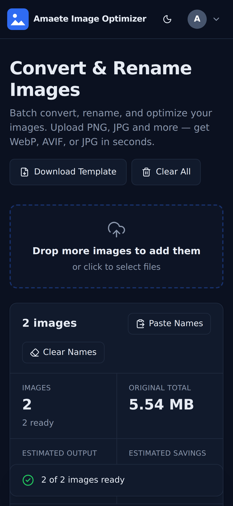
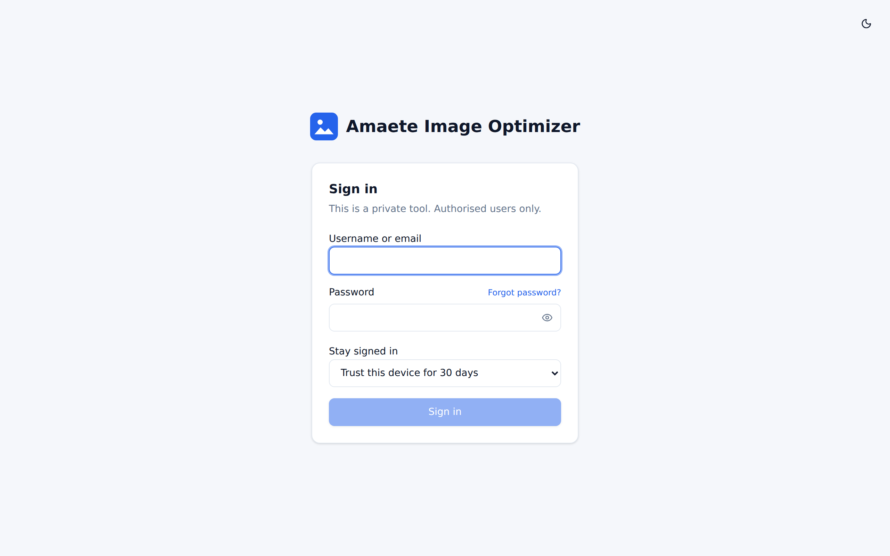

# Amaete Image Optimizer

**A private, self-hosted image converter and bulk image optimizer.** Batch convert PNG, JPG, WebP, AVIF, GIF, BMP and TIFF to **WebP, AVIF, JPG or PNG**, compress images to a **target file size**, resize, strip metadata and **bulk rename** files, all from one web page on your own server.

Think of it as a self-hosted alternative to online tools like TinyPNG or Squoosh. Your images never leave your machine, it handles a hundred files at once, and it renames them for the web while it's at it.



## Why use it

- **Private by design.** It runs on your own hardware (a Raspberry Pi is plenty) behind a login. Nothing is uploaded to a third-party service.
- **Batch everything.** Drop in one image or a hundred and convert, compress, resize and rename them in one pass.
- **Hit a size budget.** Type a target like `200 KB` and each image gets the highest quality that still fits.
- **See the savings before you convert.** File sizes are real test encodes, not guesses.
- **Web-ready file names.** Spaces become hyphens, names are lowercased and duplicates are caught before anything is written.

## Features

### Convert and compress
- **Input formats:** PNG, JPG/JPEG, WebP, AVIF, GIF (including animated), BMP, TIFF, HEIF
- **Output formats:** WebP (default), AVIF, JPG or PNG
- **Quality slider** (1–100), or a **target file size in KB** that picks the quality for each image automatically
- PNG output below quality 100 is palette-quantised (like pngquant) so it actually shrinks
- Live, test-encoded size estimates for one image, and progressive estimates with totals for a batch

### Resize
- By width, height, exact box or percentage
- Aspect-ratio lock and upscaling protection
- Presets for common widths (3840, 2560, 1920, 1600, 1280, 1080)

### Rename in bulk
- Keep original names, edit names inline, **paste a list of names**, or **upload a CSV** (old name → new name)
- A CSV template is generated from your current files
- Optional web-safe names (spaces → hyphens, lowercase) and duplicate detection

### Metadata
- **Strip EXIF, GPS, XMP, IPTC and ICC** for smaller, privacy-safe web images, or preserve them

### Download
- One file, selected files, or everything, individually or as a **ZIP**

### Security
- Username and password login (**Argon2id** hashing), optional 30/60/90-day trusted devices
- Session list with sign-out, password change, login throttling
- Files are only reachable by their owner and are **deleted automatically after 6 hours**
- `noindex` headers so search engines don't list your instance

## Screenshots

| Single image, light mode | Phone, dark mode | Sign-in |
|---|---|---|
|  |  |  |

## Quick start

Requires **Node.js 20.9+** (22 recommended).

```bash
git clone https://github.com/amaeteventurestudios/image_conversion.git
cd image_conversion
npm install
npm run user -- create yourname      # prompts for a password (min 10 characters)
npm run dev                          # API on :3000, UI on http://localhost:5173
```

### Run with Docker

```bash
cp .env.example .env
mkdir -p data && sudo chown 1000:1000 data
docker compose up -d --build
docker compose exec images node_modules/.bin/tsx server/cli.ts create yourname
```

The app listens on `127.0.0.1:3000`. Put it behind HTTPS with Caddy or another reverse proxy.

### Run on a Raspberry Pi

It runs well on a Raspberry Pi 4 (arm64). **[docs/DEPLOY-PI.md](docs/DEPLOY-PI.md)** walks through a private setup with Docker, Caddy, HTTPS and Tailscale on a custom subdomain.

### Production without Docker

```bash
npm ci
npm run build
npm run user -- create yourname
npm start                            # serves UI + API on http://127.0.0.1:3000
```

Settings are environment variables. See [`.env.example`](.env.example) for upload limits, file lifetime, concurrency and session length.

## Managing users and passwords

There's no email, so passwords are reset by whoever can run commands on the server:

```bash
npm run user -- reset-password yourname   # sets a new password and signs out every device
npm run user -- revoke-sessions yourname
npm run user -- list
```

With Docker, prefix these with `docker compose exec images node_modules/.bin/tsx server/cli.ts`, for example `... reset-password yourname`.

## Built with

This app stands on a lot of excellent open-source work. It lists **31 packages directly**, and **381 open-source packages** in total once their own dependencies are counted.

| Layer | Software |
|---|---|
| Image engine | [sharp](https://sharp.pixelplumbing.com/) on [libvips](https://www.libvips.org/) (WebP, AVIF, JPEG, PNG, resizing), bmp-js for BMP input |
| Server | [Node.js](https://nodejs.org/), [Express](https://expressjs.com/), SQLite via [better-sqlite3](https://github.com/WiseLibs/better-sqlite3), Argon2 via [@node-rs/argon2](https://github.com/napi-rs/node-rs), Multer (uploads), Archiver (ZIP), Helmet (security headers) |
| Interface | [React](https://react.dev/), [Tailwind CSS](https://tailwindcss.com/), [Radix UI](https://www.radix-ui.com/), [Lucide](https://lucide.dev/) icons, built with [Vite](https://vite.dev/) and TypeScript |
| Hosting (optional) | Docker, [Caddy](https://caddyserver.com/), [Let's Encrypt](https://letsencrypt.org/) via acme.sh, [Tailscale](https://tailscale.com/) |

## Project layout

```
server/     Express API: auth, uploads, estimates, conversion, downloads, cleanup
shared/     File-name normalisation, CSV mapping, settings validation (used by both sides)
web/        React + Tailwind single-page UI
deploy/     systemd unit and Caddyfile
docs/       Deployment guide and screenshots
```

## Security notes

- Every `/api` route except login requires a session, and files are only reachable by their owner.
- Session tokens are random 256-bit values, and only their SHA-256 hash is stored. Cookies are `HttpOnly`, `SameSite=Strict`, and `Secure` over HTTPS.
- State-changing requests must come from the app's own origin.
- Login attempts are throttled per IP address and username.
- File names are sanitised on the server regardless of what the browser sends.
- `noindex` only discourages search engines. The login is what keeps the tool private.

## Roadmap

AI-suggested file names, saved presets, a before/after comparison view, cropping and watermarking.

---

**Keywords:** self-hosted image converter, bulk image optimizer, batch image compressor, convert PNG to WebP, convert JPG to AVIF, compress image to specific size, batch rename images, CSV bulk rename, strip EXIF metadata, Raspberry Pi image server, private TinyPNG alternative, Squoosh alternative, sharp libvips web UI.
